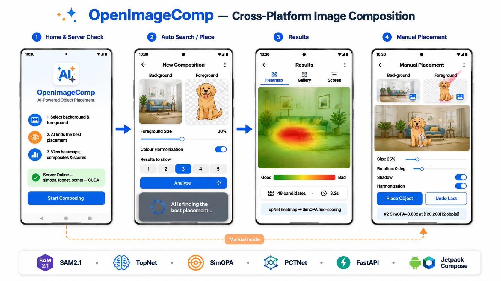

# OpenImageComp

**Open-source Image Composition Framework** — Segmentation, Placement, Assessment, Harmonization, and Model Interpretability in a unified pipeline.

Built on top of BCMI Lab's research (OPA, TopNet, libcom). Deployed as a Gradio web application, a FastAPI REST server, and an Android mobile client.



## Project Structure

```
├── placement_app/              # Interactive application (Gradio + REST API)
│   ├── app.py                  # Gradio web app (3 placement modes)
│   ├── server.py               # FastAPI server for Android client
│   ├── sam2_demo.py            # SAM2 vs OpenCV comparison demo
│   ├── interpretability.py     # Grad-CAM, saliency, occlusion, feature viz
│   ├── models/                 # SimOPA + TopNet + PCTNet wrappers
│   ├── pipeline/               # Compositing, scoring, harmonization, auto-mask, shadow
│   └── assets/                 # 8 background + 8 foreground presets (from OPA dataset)
│
├── topnet_fixed/               # TopNet with fixed Transformer + complete training pipeline
│   ├── models/topnet.py        # Fixed ObPlaNet (79M/113M, 2ch/1ch, per-token/global MLP)
│   ├── losses.py               # CrossEntropy + FocalLoss (α=2, β=4)
│   ├── data/                   # Sparse CE + Gaussian-heatmap + Dilated dataset loaders
│   ├── configs/                # 17 YAML configs for ablation experiments
│   ├── train_stage1.py         # Stage 1: freeze encoders, train Transformer+Decoder
│   ├── train_stage2.py         # Stage 2: unfreeze all, full-model fine-tuning
│   ├── evaluate/               # Per-model evaluation scripts (11 models)
│   └── sh_scripts/             # Bash run scripts (training + evaluation)
│
├── ImageCompApp/               # Android client (Jetpack Compose + Retrofit)
│   └── app/src/main/java/com/example/imagecomp/
│       ├── ui/screens/         # HomeScreen, PlaceScreen, ResultScreen, ManualScreen
│       ├── data/api/           # Retrofit API service + DTOs
│       └── data/repository/    # CompRepository (network + base64 decoding)
│
├── OPA/                        # Original OPA reference code
├── libcom-main/                # libcom reference toolbox
├── TopNet-Object-Placement-main/  # Original TopNet (buggy) reference code
├── papers/                     # Reference papers (PDF)
├── report.tex                  # Course project report (pdflatex)
├── references.bib              # BibTeX references
├── Design.md                   # Technical architecture analysis
└── CodeDesign.md               # Detailed code walkthrough
```

## Quick Start — Gradio Web App

```bash
cd placement_app
pip install -r requirements.txt
python app.py          # → http://127.0.0.1:7860
```

### Three Placement Modes

| Tab | What it does |
|-----|-------------|
| **Auto Search** | TopNet heatmap or Grid enumeration → SimOPA fine-scoring → top-K recommended composites |
| **Manual Placement** | Click-to-place on background with scale/rotation controls, multi-object stacking, undo/reset |
| **Interpretation** | Grad-CAM, saliency maps, occlusion experiments, feature visualization on the top-ranked placement |

### Features

- **Segmentation**: SAM2.1 (Hiera-Small, 46M) or classical OpenCV (border-color + Otsu), with auto-fallback on failure
- **Placement**: TopNet (CVPR 2023) heatmap search or Grid enumeration, both refined by SimOPA scoring
- **SimOPA Scoring Modes**: 4ch (RGB+mask, default), 3ch (RGB only), crop (local region)
- **Harmonization**: PCTNet (ViT-based, 4.8M) with Reinhard color transfer fallback (Lab-space statistics)
- **Shadow Rendering**: Soft drop shadow via graphical ellipse + Gaussian blur (CPU, no DL needed)
- **Model Interpretability**: Grad-CAM, saliency, occlusion, and intermediate feature maps on the best composite

## Quick Start — Server for Android App

```bash
cd placement_app
pip install fastapi uvicorn
python server.py --port 8000
# → http://<your-ip>:8000/docs (Swagger UI)
```

### REST API Endpoints

| Endpoint | Method | Description |
|----------|--------|-------------|
| `/api/place` | POST | Auto-search placement (TopNet or Grid) |
| `/api/place_manual` | POST | Click-to-place with SimOPA scoring |
| `/api/harmonize` | POST | Color harmonization (PCTNet/Reinhard) |
| `/api/mask` | POST | Foreground segmentation (SAM2/OpenCV) |
| `/api/health` | GET | Server status + loaded models |

### Android Client

The Android app (Jetpack Compose + Retrofit) provides the same functionality as the Gradio web app:
- **Home Screen**: Server health check, model status
- **Auto Search**: Background + foreground selection, foreground scale slider, harmonization toggle, top-K selector
- **Result Screen**: Three-tab view — Heatmap (placement probability overlay), Gallery (2-column composite grid with SimOPA scores), Scores (sortable detail table)
- **Manual Placement**: Tap-to-place with crosshair, scale/rotation sliders, shadow and harmonization switches, undo/reset

The app communicates with the FastAPI server over the local network (phone and computer must be on the same LAN). The computer runs all models; the phone sends image uploads and receives base64-encoded results.

## Training — TopNet (Fixed Transformer)

### Data Preparation

Dataset and pretrained weights are available at:

> **SJTU Cloud Drive**: [https://pan.sjtu.edu.cn/web/share/7d842afe7e9850ff1d5453dc62a19a7a](https://pan.sjtu.edu.cn/web/share/7d842afe7e9850ff1d5453dc62a19a7a) (code: `njb3`)

Place under `topnet_fixed/data/data/`:

```
data/data/
├── bg/                         # background images
├── fg/                         # foreground images
│   └── foreground/             # source fg + mask_{id}.jpg
├── train_pair_new.json         # training annotations
├── test_pair_new.json          # test annotations
└── SOPA.pth.tar                # SOPA encoder weights
```

### Two-Stage Training Strategy

| | Stage 1 | Stage 2 |
|---|---|---|
| bg_encoder | Frozen (SOPA pretrained) | Unfrozen |
| fg_encoder | Frozen (ImageNet pretrained) | Unfrozen |
| Transformer + Decoder | Trained | Trained |
| Learning rate | 1e-4 | 1e-5 |
| Optimizer | AdamW | AdamW |
| Batch size | 32 | 32 |
| Early stopping | val_loss, patience=8 | val_loss, patience=12 |

### Model Architecture

We fixed two bugs in the original TopNet Transformer:

1. **LayerNorm dimension**: Changed from `LayerNorm(8)` (normalizing spatial columns) to `LayerNorm(1024)` (normalizing feature dimension)
2. **MHA batch-first**: Changed from default `batch_first=False` (which treated batch as sequence) to `batch_first=True` (proper cross-position attention)
3. **MLP variants**: We provide three MLP designs:
   - **Per-token** (our fixed): `Linear(1024 → hidden → 1024)`, 79M or 113M
   - **Global** (buggy-style, our best): `Linear(65536 → 128 → 65536)`, flattens the entire feature map through a 128-dim bottleneck — 113M

### Loss Functions

| Loss | Target | Supervision | Best Model |
|------|--------|-------------|------------|
| **Sparse CrossEntropy** | Single-pixel 0/1/255 | ~6 px/image | CE globalMLP: F1=0.680, AP=0.741 |
| **Focal partial** | Gaussian heatmap + valid_mask | pos+neg regions only | Focal globalMLP: F1=0.688, AP=0.744 |
| **Dilated CE** | Disk r=3, binary 0/1/255 | ~174 px/image | CE dilated: F1=0.649 |
| Focal full (abandoned) | All pixels supervised | model collapse (F1=0) | — |

### Ablation Experiments (17 YAML configs)

| Exp | Config | Model | Loss | Params |
|-----|--------|-------|------|--------|
| Buggy | — | Original TopNet | CE | 113M |
| A | `stage1_ce.yaml` | Per-token | CE | 79M |
| A-113M | `stage1_ce_113M.yaml` | Per-token | CE | 113M |
| A-globalMLP | `stage1_ce_globalMLP.yaml` | Global MLP | CE | 113M |
| A2 | `stage1_ce_dilated.yaml` | Per-token | Dilated CE | 79M |
| A2-113M | `stage1_ce_dilated_113M.yaml` | Per-token | Dilated CE | 113M |
| B | `stage1_focal.yaml` | Per-token | Focal partial | 79M |
| B-113M | `stage1_focal_113M.yaml` | Per-token | Focal partial | 113M |
| B-globalMLP | `stage1_focal_globalMLP.yaml` | Global MLP | Focal partial | 113M |

### Training Commands

```bash
cd topnet_fixed

# Individual experiments
bash sh_scripts/expA_ce_globalMLP.sh       # CE + global MLP (best CE)
bash sh_scripts/expB_focal_globalMLP.sh    # Focal + global MLP (best overall)
bash sh_scripts/expA_ce.sh                 # CE per-token 79M
bash sh_scripts/expB_focal.sh              # Focal per-token 79M

# Single-stage execution
python train_stage1.py --config configs/stage1_ce_globalMLP.yaml --device cuda
python train_stage2.py --config configs/stage2_ce_globalMLP.yaml --device cuda
```

### Evaluation

```bash
# All 11 models, one process each (safe GPU cleanup)
bash sh_scripts/eval_all.sh

# Single model
python evaluate/eval_buggy.py
python evaluate/eval_expB_focal_globalMLP.py
```

## Key Results

All models evaluated on the 2568-image TopNet test set using sparse F1, balanced accuracy (bAcc), VOC Average Precision (AP), and F1 at threshold 0.5 (F1@0.5).

| Model | F1 | bAcc | AP | Rec | Params |
|-------|-----|------|-----|------|--------|
| Buggy TopNet (original) | 0.661 | 0.755 | 0.678 | 0.739 | 113M |
| CE per-token (79M) | 0.660 | 0.750 | 0.736 | 0.617 | 79M |
| CE per-token (113M) | 0.682 | 0.767 | 0.737 | 0.667 | 113M |
| CE globalMLP (113M) | 0.680 | 0.767 | 0.741 | 0.683 | 113M |
| CE dilated (79M) | 0.649 | 0.743 | 0.712 | 0.620 | 79M |
| Focal per-token (79M) | 0.672 | 0.764 | 0.714 | 0.746 | 79M |
| Focal per-token (113M) | 0.672 | 0.766 | 0.707 | 0.796 | 113M |
| **Focal globalMLP (113M)** | **0.688** | **0.781** | **0.744** | **0.834** | 113M |
| Paper reference (TopNet) | 0.741 | 0.815 | — | — | 113M |

**Key findings**:

1. **Global MLP + fixed attention is the best design.** The `65536→128→65536` bottleneck forces the network to learn a compact global spatial representation that per-token MLPs must learn entirely through attention. Combined with corrected LayerNorm and MHA, this variant achieves the best results across all metrics.

2. **Focal Loss with partial supervision provides the best recall.** By converting sparse annotations to Gaussian heatmaps and using a validity mask that does not penalize unlabeled pixels, the model learns to predict high scores over a wider area (recall 0.834) while respecting annotation semantics.

3. **All fixed models outperform the released buggy checkpoint.** The publicly available buggy model scores F1=0.661, well below the paper's claim of 0.741. Our best model reaches F1=0.688 with identical parameter count.

4. **CE excels at ranking quality (AP), Focal excels at coverage (Recall).** CE models achieve higher AP (0.736-0.741) through conservative precision, while Focal models achieve higher recall (0.746-0.834) through broader prediction regions.

5. **Label dilation degrades performance.** Expanding sparse points to radius-3 disks introduces boundary noise that offsets the benefit of increased supervision density.

## Model Interpretability

The Gradio app provides five visualization methods on the top-ranked placement:

| Method | Description |
|--------|-------------|
| **Grad-CAM** | Gradient-weighted activation maps on SimOPA's layer4 |
| **Saliency** | Input gradient magnitude ‖∂score/∂pixel‖ |
| **Occlusion** | Sliding 40×40 gray window → score drop map |
| **Features L2** | ResNet layer2 activations (32×32, mid-level texture) |
| **Features L4** | ResNet layer4 activations (8×8, high-level semantics) |

## References

- OPA: [Object Placement Assessment Dataset](https://arxiv.org/abs/2107.01889) (arXiv 2021)
- TopNet: [Transformer-based Object Placement Network](https://github.com/bcmi/TopNet-Object-Placement) (CVPR 2023)
- FOPA: [Fast Object Placement Assessment](https://arxiv.org/abs/2205.14280) (ECCV 2022)
- CenterNet: [Objects as Points](https://arxiv.org/abs/1904.07850) (Zhou et al., 2019)
- Focal Loss: [Focal Loss for Dense Object Detection](https://arxiv.org/abs/1708.02002) (Lin et al., 2017)
- SAM2: [Segment Anything 2](https://github.com/facebookresearch/sam2) (Meta, 2024)
- PCTNet / Reinhard / libcom: [BCMI Lab](https://github.com/bcmi/libcom)

## License

MIT
